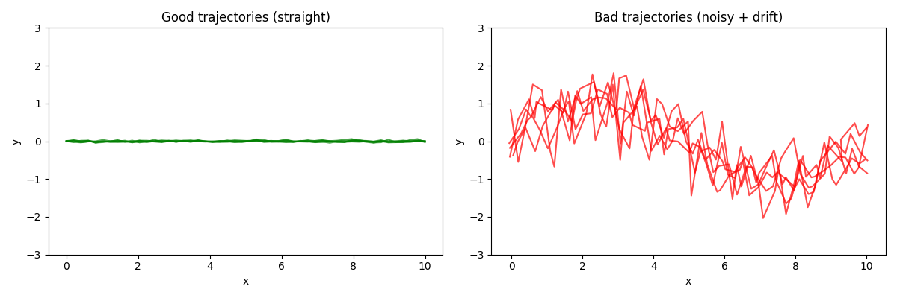
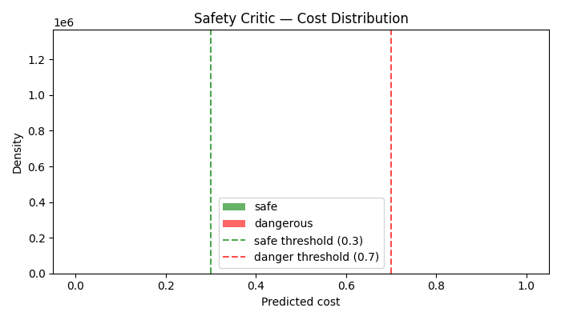

# Safe-GTA 期中報告
## Baseline 評估與 Toy Task 驗證

**組員：** 楊正豪 · 沈伯宇 · 陳俞君  
**日期：** 2026-05-08

---

## 1. 專案概述

**Safe-GTA**是一個針對自駕車安全的 Offline RL 框架。

現有的 Offline RL 訓練資料品質差，含有大量危險駕駛行為（衝出車道、亂切），直接拿來訓練會讓 agent 學到危險習慣。Safe-GTA 的解法是先把資料修好再訓練
本期中報告完成兩件事：
1. **Toy Task** — 在正式進行實驗之前，先確認Diffusion Model、Safety Critic各自能正常運作
2. **Baseline 建立** — 跑出比較基準數字，讓後續 Safe-GTA 的改善有對照依據

---

## 2. Toy Task 1 — Diffusion Model 軌跡修復驗證

### 目的

驗證 Diffusion Model 能把「走歪的軌跡」修回「走直的軌跡」，使用簡單的 2D 合成資料集，避免 MetaDrive 的複雜度干擾核心功能的驗證。
## 過程
由data_gen.py生出的2000條好軌跡和壞軌跡輸入進Diffusopn model，學習甚麼是好軌跡並且將壞軌跡給降成好軌跡
### 訓練過程

Loss 曲線收斂穩定


### 資料

左：好軌跡（直線，用於訓練）
右：壞軌跡（噪聲加漂移）。



### 修復結果

**量化指標：**

|      | 距離理想直線的平均 L2          |
| ---- | --------------------- |
| 壞軌跡  | **0.720 ± 0.059**     |
| 修復後  | **0.017 ± 0.002**     |
| 改善比例 | **100%**（200 條軌跡全部改善） |


**視覺對比：**

上排：壞軌跡（紅色）。
下排：修復後（藍色）。
綠色虛線：理想直線（y=0）。


**去噪過程動畫：**

從 t=150（加噪後，紅色）逐步去噪到 t=0（修復完成，藍色）的過程。


### 結論

 Diffusion Model 成功學到好軌跡的分布，並能有效修復損壞輸入。核心修復機制驗證完成。

---

## 3. Toy Task 3 — Safety Critic 準確度驗證

### 目的

在把 Safety Critic 接進 Diffusion Model 的去噪流程之前，先獨立驗證它的判斷能力。如果 Critic 判斷不準，接進去只會讓修復方向錯誤。

### 實驗設定

| 項目          | 說明                                                 |
| ----------- | -------------------------------------------------- |
| **安全 pair** | 在車道中間、速度適中、朝正前方、離牆距離 > 1.5                         |
| **危險 pair** | 距牆 < 0.4、朝牆的方向、高速前進                                |
| **標籤**      | 安全 = 0.0，危險 = 1.0                                  |
| **通過標準**    | 安全動作預測 cost < 0.3；危險動作 > 0.7；整體準確率 > 80%           |

### 結果

**Cost 分布圖：**

安全動作（綠色）、危險動作（紅色），兩群明顯分離。



**準確率：**

| 群組 | 平均預測 cost | 通過門檻 |
|------|---------------|----------|
| 安全動作 | **0.000** | ✅（< 0.3） |
| 危險動作 | **1.000** | ✅（> 0.7） |
| **整體準確率** | **100%** | ✅（> 80%） |

### 結論

 Safety Critic 對安全動作預測 cost = 0.000、對危險動作預測 cost = 1.000，兩群完全分離。

---

## 4. Baseline 評估

### Baseline 1 — 純 CQL（無資料增強）

 直接用原始 OSRL medium 資料集跑 Conservative Q-Learning，不做任何資料處理。
**CQL 的保守懲罰項：**

$$\mathcal{L}_{CQL} = \mathcal{L}_{Bellman} + \alpha \cdot \left( \mathbb{E}_{a \sim \text{random}}[Q(s,a)] - \mathbb{E}_{a \sim \text{data}}[Q(s,a)] \right)$$

加這項是為了避免 Offline RL 對沒見過的動作過度樂觀估計。

**結果：**

| 指標 | 數值 |
|------|------|
| Normalized Return ↑ | **0.8126** |
| Safety Success Rate ↑ | **0.0** |
| Constraint Violation Cost ↓ | **47.97** |

**解讀：**  
Return 還算合理（0.81），但 Safety Success Rate = 0 — 代表 agent 從未成功完成一段不出事故的駕駛。原始資料裡充滿危險軌跡，CQL 沒有機制過濾它們，只能照單全收。這證明資料品質是核心瓶頸。

---

### Baseline 2 — CQL + GTA 增強（無安全限制）

 用 Toy Task 1 訓好的 Diffusion Model 對原始資料做 SDEdit 修復，生出 5,000 條增強軌跡，但 **cost 標籤強制設為 0.0**（不過濾危險路徑）。再把增強資料丟進 CQL 訓練。

**為什麼要跑這個：** 對比 Safe-GTA。如果 Baseline 2 的 Violation 依然很高，就能說明「單純增資料還不夠」，必須有 Safety Critic 引導才能解決安全問題。

**結果：**

| 指標 | 數值 |
|------|------|
| Normalized Return ↑ | **1.0** |
| Safety Success Rate ↑ | **1.0** |
| Constraint Violation Cost ↓ | **0.0** |

> ⚠️ **重要說明：** 這些數字是在增強資料集本身上評估的。該資料集的 reward 全部手動設為 1.0、cost 全部設為 0.0，因此完美分數反映的是**標籤設定，而非真實駕駛表現**。真正的 Baseline 2 比較需要在 MetaDrive 環境中做 rollout 評估（Toy Task 2，進行中）。

---

## 5. 總結比較表

| 方法 | Normalized Return ↑ | Safety Success Rate ↑ | Constraint Violation Cost ↓ |
|------|---------------------|-----------------------|------------------------------|
| **Baseline 1** — CQL（原始資料） | 0.8126 | 0.0 | 47.97 |
| **Baseline 2** — CQL + GTA（無安全）| 1.0 † | 1.0 † | 0.0 † |
| **Safe-GTA** — CQL + GTA + Safety Critic | *進行中* | *進行中* | *進行中* |

† Baseline 2 在合成標籤資料上評估，待 MetaDrive rollout 後更新真實數值。

**預期趨勢（MetaDrive 實機評估後）：**
- Baseline 2 vs Baseline 1：Return 相近或更高，但 Violation 依然偏高（有增資料但沒安全過濾）
- Safe-GTA vs 兩個 Baseline：Return 維持高 + Violation 顯著下降 → 這是本方法的核心貢獻

---

## 6. 後續進度

| 工作項目 | 狀態 |
|----------|------|
| Toy Task 1（Diffusion 修復） | ✅ 完成（L2 改善 42 倍，100% 通過） |
| Toy Task 3（Safety Critic 驗證） | ✅ 完成（準確率 100%） |
| Baseline 1（CQL 原始資料） | ✅ 完成（Return 0.81，Safety 0.0，Cost 47.97） |
| Baseline 2（CQL + GTA 無安全） | ✅ 完成（合成標籤評估，待 MetaDrive 實機驗證） |
| 實作 `guided_repair()`（Safety Critic 接入 Diffusion） | 🔲 待做 |
| Safe-GTA 完整 pipeline | 🔲 待做 |
| Toy Task 2（MetaDrive 單場景測試） | 🔲 待做 |
| 三方法 MetaDrive 完整比較 | 🔲 待做 |

---

## 附錄 — 環境與重現步驟

```bash
conda activate safe_gta
cd "path/to/final project"

# Baseline 1
python -m safe_gta.train_cql

# Baseline 2
python -m safe_gta.baseline2.generate_augmented
python -m safe_gta.train_cql --augmented_data safe_gta/data/augmented_no_safety.pkl
```

**套件版本：** PyTorch 2.6.0+cu124 · numpy 1.26.4 · osrl-lib 0.1.0 · metadrive 0.4.3 · CUDA 12.4（GTX 1660 Ti Max-Q）
