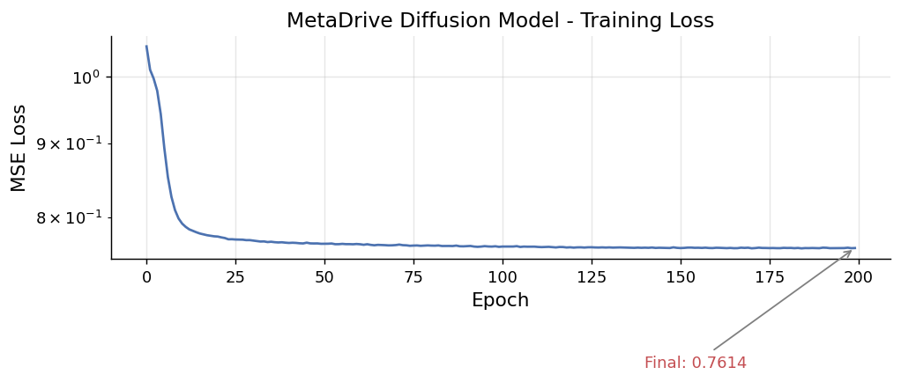
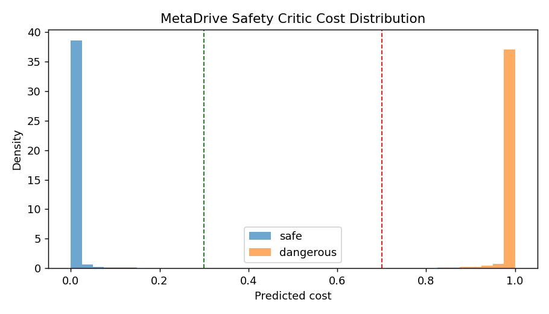
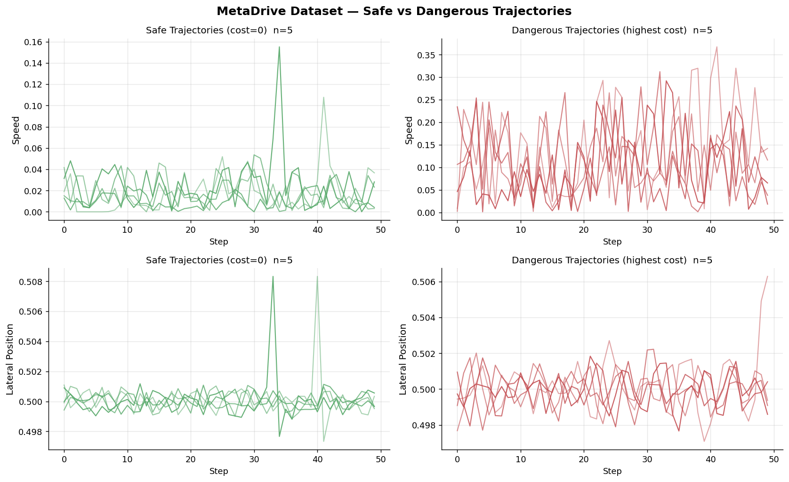
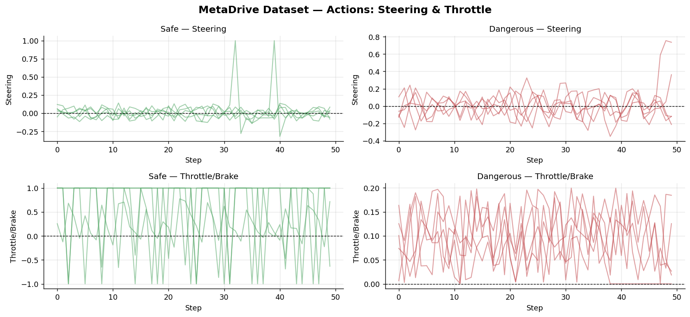
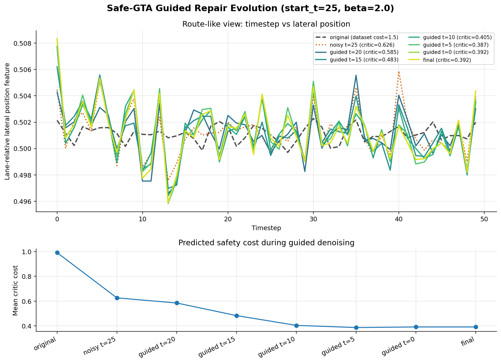
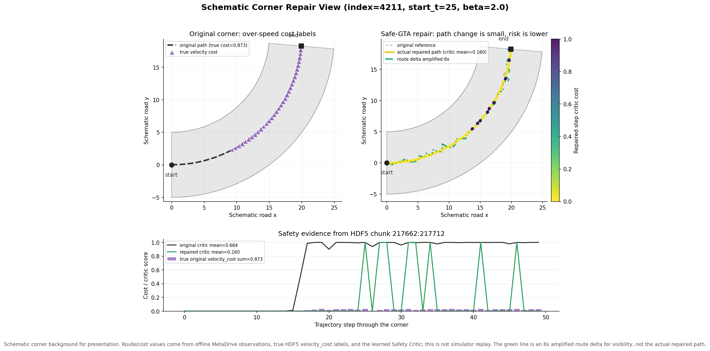
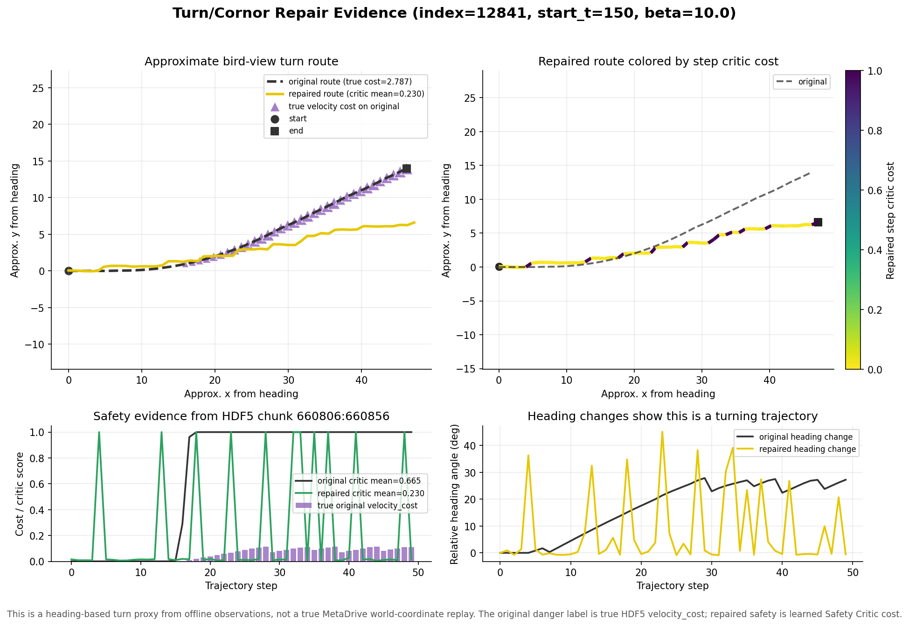

# Safe-GTA 實驗結果報告

**專案名稱：** Safe-GTA: Physics-Informed Generative Trajectory Augmentation for Safe Offline RL  
**資料集：** MetaDrive Offline Dataset (`metadrive_mediumsparse.hdf5`)  
**日期：** 2026-06-05  
**組員：** 楊正豪、沈伯宇、陳俞君

---

## 方法流程

目前 pipeline 如下：

```text
MetaDrive HDF5 dataset
        |
        |-- train_diffusion.py
        |       -> diffusion_metadrive_final.pt
        |
        |-- safety_critic.py
        |       -> metadrive_safety_critic.pt
        |
        |-- generate_safe_gta.py
        |       -> augmented_safe_gta_t25_beta20.pkl
        |
        |-- train_cql.py
                -> safe_gta_cql_results.json
```

核心 guidance 公式可以用下面方式說明：

```text
x_prev = denoise(x_t) - beta * grad_x mean(SafetyCritic(x_t))
```

直覺上：

- diffusion model 負責讓 trajectory 仍然像 MetaDrive 真實資料。
- Safety Critic 負責把 trajectory 往低 cost 的方向推。
- `start_t` 控制 repair 有多激進。
- `beta` 控制 safety guidance 的強度。

---

## Dataset 與模型設定

使用的主要 dataset：

```text
safe_gta/data/metadrive_mediumsparse.hdf5
```

資料維度：

```text
observation dimension = 259
action dimension      = 2
joint feature dim     = 261
trajectory length     = 50
```

Diffusion model：

```text
epochs       = 200
first loss   = 1.0499
final loss   = 0.7614
checkpoint   = safe_gta/checkpoints/diffusion_metadrive_final.pt
```



---

## Safety Critic 結果

Safety Critic 使用 MetaDrive dataset 裡的 `costs` 作為 supervision，輸入 normalized `(observation, action)`，輸出每一步的 predicted cost。

Validation 結果：

| 指標 | 數值 |
|---|---:|
| Accuracy | **0.991975** |
| Safe mean predicted cost | **0.0065** |
| Dangerous mean predicted cost | **0.9812** |
| Safe pass rate (`cost < 0.3`) | **0.9952** |
| Dangerous pass rate (`cost > 0.7`) | **0.9797** |

這表示 Safety Critic 單獨看 dataset transitions 時能準確分辨 safe / dangerous。




---

## Augmented Dataset 結果

### Vanilla GTA

這次已重新產生 MetaDrive 版 Vanilla GTA：

```bash
python -m safe_gta.baseline2.generate_augmented --checkpoint safe_gta/checkpoints/diffusion_metadrive_final.pt --n_augmented 5000 --start_t 150 --output safe_gta/data/augmented_no_safety.pkl
```

輸出 shape：

```text
observations: (5000, 50, 259)
actions:      (5000, 50, 2)
```

這表示 Baseline 2 現在已經是 MetaDrive observation 維度，不再是舊 toy-task 2D 版本。

注意：Vanilla GTA baseline 的 generated data 目前仍然把：

```text
reward = 1.0
cost   = 0.0
```

所以它的 CQL evaluation 會得到完美 safety，不代表 agent 真的安全。它的用途是證明「沒有 safety filtering 的 augmentation pipeline 可以跑通」，但不能當作真正 safety claim。

### Safe-GTA

Safe-GTA 使用：

```text
safe_gta/data/augmented_safe_gta_t25_beta20.pkl
```

輸出 shape：

```text
observations: (5000, 50, 259)
actions:      (5000, 50, 2)
costs:        (5000, 50)
```

關鍵 generation 結果：

```text
mean predicted cost = 0.0891
pass rate under 0.35 = 100.0%
```

---

## 8. CQL 結果比較

![[Pasted image 20260605174059.png]]


---

## 視覺化結果

### Dataset Safe vs Dangerous



這張圖顯示 MetaDrive offline dataset 中 safe trajectories 和 dangerous trajectories 在 speed / lateral position 等 feature 上的差異。

### Actions Distribution



這張圖比較 safe / dangerous trajectories 的 steering 與 throttle 行為。


### Guided Repair 路線變化歷程圖



這張圖是為了跟 TA 說明「Safe-GTA 在 denoising 過程中如何改變軌跡」而產生的 route-like visualization。  
它不是 MetaDrive simulator 的實際鳥瞰道路 render，而是使用 observation 裡的 lane-relative lateral position feature 作為 y-axis，timestep 作為 x-axis，近似顯示車輛在 lane-relative route 上的變化。

這次自動挑選了一條修復前後風險下降最明顯的 trajectory：

```text
dataset trajectory index = 3039
dataset total cost       = 1.480
original critic cost     = 0.9907
final critic cost        = 0.3918
critic cost improvement  = 0.5988
```

denoising 歷程中的 critic cost：

| Stage | Mean critic cost |
|---|---:|
| original | 0.9907 |
| noisy t=25 | 0.6262 |
| guided t=20 | 0.5849 |
| guided t=15 | 0.4834 |
| guided t=10 | 0.4047 |
| guided t=5 | 0.3871 |
| guided t=0 / final | 0.3918 |

可以跟 TA 這樣說：

> 這張圖不是實際車道地圖，而是 lane-relative trajectory proxy。它顯示同一條 trajectory 在 Safe-GTA guided repair 過程中，Safety Critic 預測風險從 0.9907 下降到 0.3918，代表 safety guidance 確實有在 denoising 過程中把軌跡往低風險方向修正。


### 轉角過彎修正示意圖



這張圖是為了報告展示而做的 schematic corner view。它把同一條 offline trajectory 放到一個清楚的轉角背景上，讓「過彎」這件事更容易看出來。

重要限制：

```text
這不是 MetaDrive simulator 的真實道路 replay。
轉角背景是 schematic visualization。
但 trajectory/cost 數值來自 offline MetaDrive observation、HDF5 velocity_cost label、以及 Safety Critic prediction。
```

使用的 trajectory index 是 `4211`：

```text
true dataset cost       = 0.8732
true velocity_cost      = 0.8732
original critic mean    = 0.6644
repaired critic mean    = 0.1603
```

可以跟 TA 這樣說：

> To make the turning case visually clear, we place the selected offline trajectory on a schematic corner background. The purple markers indicate true velocity cost from the MetaDrive HDF5 labels, meaning the original turn is unsafe due to speed-related cost. After Safe-GTA repair, the learned Safety Critic mean cost drops from 0.6644 to 0.1603, suggesting the repaired corner trajectory is lower risk according to our safety model.

### 9.9 大幅路徑修改的過彎案例



前一張 schematic corner 圖的路徑幾何差異不明顯，所以我們額外搜尋了一個「路徑變化比較大」的 turning case。  
這張圖使用 heading-based route reconstruction，也就是根據 observation 裡的 heading cosine/sine 近似重建鳥瞰路線，因此比 lane-relative plot 更容易看出轉彎軌跡的變化。

使用的 trajectory index 是 `12841`，並使用較激進的 repair setting：

```text
start_t = 150
beta    = 10.0
```

結果：

```text
heading change range = 27.88 deg
true dataset cost    = 2.7866
true velocity_cost   = 2.7866
original critic mean = 0.6652
repaired critic mean = 0.2296
```


---

結果

1. Safe-GTA pipeline 已經完整接起來。
2. Safety Critic 在 MetaDrive offline dataset 上有高分類準確率。
3. `start_t=150` 的 guided repair 失敗，顯示過強 noise 會破壞 trajectory safety。
4. `start_t=25, beta=2.0` 的 guided repair 成功產生 low-cost trajectories。
5. Safe-GTA 的核心概念，也就是用 Safety Critic gradient 引導 diffusion repair，在正確參數下可行。


## 主要產出檔案

```text
safe_gta/checkpoints/diffusion_metadrive_final.pt
safe_gta/checkpoints/metadrive_safety_critic.pt
safe_gta/checkpoints/baseline2_cql.pt
safe_gta/checkpoints/safe_gta_cql.pt

safe_gta/data/augmented_no_safety.pkl
safe_gta/data/augmented_safe_gta_t25_beta20.pkl

safe_gta/results/metadrive_safety_critic_results.json
safe_gta/results/baseline2_cql_results.json
safe_gta/results/safe_gta_cql_results.json
safe_gta/results/baseline_comparison.png
safe_gta/results/diffusion_metadrive_loss.png
safe_gta/results/metadrive_safety_critic_costs.png
safe_gta/results/guided_repair_evolution_route.png
safe_gta/results/guided_repair_topdown_route.png
safe_gta/results/metadrive_danger_reason_topdown.png
safe_gta/results/metadrive_crash_label_evidence.png
safe_gta/results/metadrive_corner_repair.png
safe_gta/results/metadrive_turn_large_repair.png
```

---

## 重現指令

```bash
conda activate safe_gta
cd "C:\Users\kenny\Desktop\School\nycu course\RL\Lab\final project"

python -m safe_gta.train_diffusion --epochs 200 --batch_size 64
python -m safe_gta.safety_critic --epochs 20 --max_samples 200000

python -m safe_gta.baseline2.generate_augmented --checkpoint safe_gta/checkpoints/diffusion_metadrive_final.pt --n_augmented 5000 --start_t 150 --output safe_gta/data/augmented_no_safety.pkl
python -m safe_gta.train_cql --augmented_data safe_gta/data/augmented_no_safety.pkl --epochs 50

python -m safe_gta.generate_safe_gta --n_augmented 5000 --beta 2.0 --start_t 25 --output safe_gta/data/augmented_safe_gta_t25_beta20.pkl
python -m safe_gta.train_cql --augmented_data safe_gta/data/augmented_safe_gta_t25_beta20.pkl --epochs 50

python -m safe_gta.visualize_results
python -m safe_gta.visualize_guided_evolution --start_t 25 --beta 2.0 --search_n 2000 --unsafe_min_cost 1.0
python -m safe_gta.visualize_topdown_repair --start_t 25 --beta 2.0 --search_n 2000 --unsafe_min_cost 1.0
python -m safe_gta.visualize_danger_reason --index 3039 --start_t 25 --beta 2.0 --output safe_gta/results/metadrive_danger_reason_topdown.png
python -m safe_gta.visualize_danger_reason --index 6118 --start_t 25 --beta 2.0 --output safe_gta/results/metadrive_crash_label_evidence.png
python -m safe_gta.visualize_corner_repair --index 4211 --start_t 25 --beta 2.0
python -m safe_gta.visualize_turn_repair --index 12841 --start_t 150 --beta 10.0 --seed 17 --output safe_gta/results/metadrive_turn_large_repair.png
```
